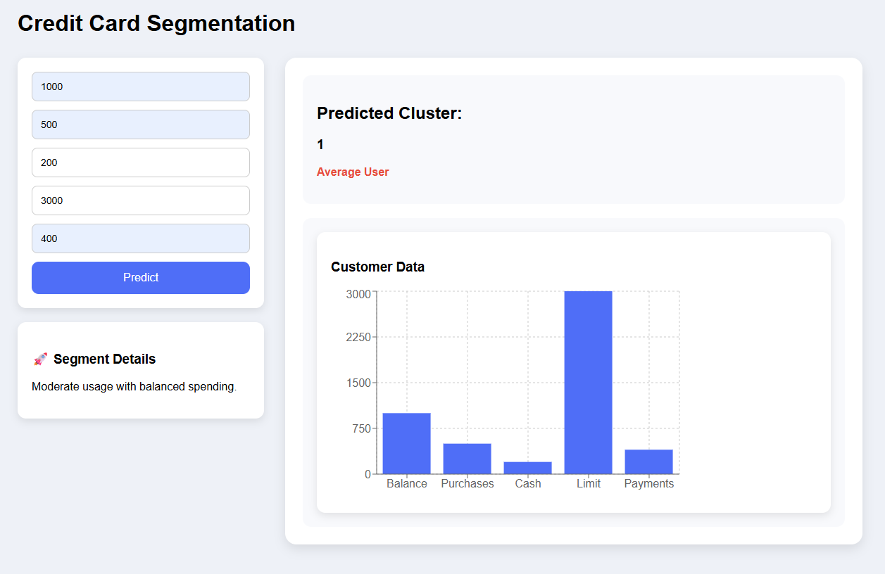

# 💳 Credit Card Customer Segmentation

A Machine Learning Web Application that classifies credit card customers based on their spending behavior.

---

## 🚀 Features

* 📊 Predict customer segment
* 🔥 Real-time ML prediction
* 📈 Data visualization using charts
* ⚡ Fast API integration with Flask

---

## 🧠 Machine Learning

* Algorithm: K-Means Clustering
* Preprocessing: StandardScaler
* Output:

  * Low Spender
  * Average Customer
  * High Spender

---

## 🛠️ Tech Stack

### Frontend

* React.js
* Axios
* Recharts

### Backend

* Flask
* Scikit-learn
* Joblib

---

## 📂 Project Structure

```
credit-card-segmentation/
│
├── backend/
│   ├── app.py
│   ├── model.pkl
│   ├── scaler.pkl
│   ├── requirements.txt
│
├── frontend/
│
├── dataset/
├── notebook/
└── README.md
```

---

## ⚙️ How to Run Locally

### Backend

```
cd backend
pip install -r requirements.txt
python app.py
```

### Frontend

```
cd frontend
npm install
npm run dev
```

---

## 📸 Screenshots



---

## 🎯 Future Improvements

* User authentication
* Cloud deployment
* Advanced analytics dashboard

---

## 👨‍💻 Author

**Bharathraj Gowda J B**
